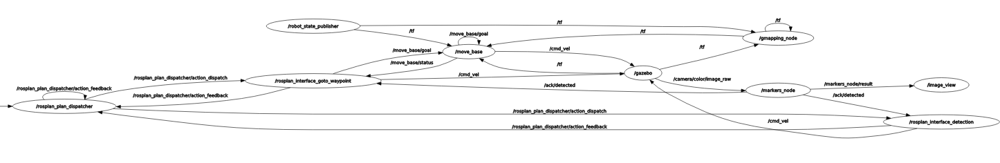
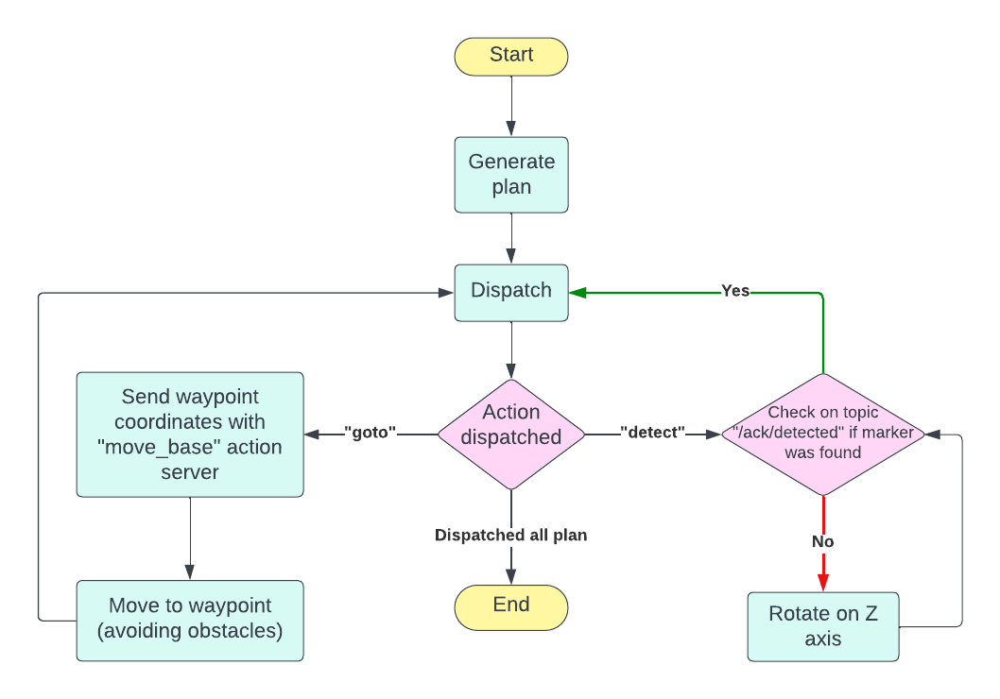

# Assignment 2

## Group members

| Name Surname          | ID       |
| --------------------- | -------- |
| [Gabriele Nicchiarelli](https://github.com/gabri00) | S4822677 |
| [Ivan Terrile](https://github.com/Ivanterry00)         | S4851947 |
| [Miriam Anna Ruggero](https://github.com/Miryru)   | S4881702 |
| [Davide Pisano](https://github.com/DavidePisano)        | S4363394 |

## Preliminary operations

You'll need to install some additional ROS packages:

```bash
cd ~/<ros_workspace>/src
git clone https://github.com/CarmineD8/aruco_ros.git
git clone https://github.com/CarmineD8/SLAM_packages.git # Remember to switch to noetic branch
git clone https://github.com/KCL-Planning/ROSPlan.git
```

For *ROSPlan* follow the instruction in their [readme](https://github.com/KCL-Planning/ROSPlan/blob/master/README.md) to properly install the dependencies.

Install dependencies:

```bash
cd ~/<ros_workspace>
rosdep install --from-paths src --ignore-src -r -y
```

Build the workspace:

```bash
cd ~/<ros_workspace>
catkin_make
catkin_make --only-pkg-with-deps my_rosplan_interface
```

## Run Gazebo simulation

Run the simulation:

```bash
roslaunch assignment_pkg simulation.launch
```

In another terminal, after launching the simulation, build and dispatch the plan:
```bash
cd ~/<ros_workspace>/src/Exp-rob-assignment2/
./rosplan_services.bash
```

To check the generated plan:
```bash
rostopic echo /rosplan_planner_interface/planner_output -p
```

## Description of the packages

The project works mainly through 3 packages:
1. *assignment_pkg*
2. *my_rosplan_interface*
3. *rosbot_ros* (and its sub-packages)

#### 1. assignment_pkg

In this package the pddl planning is implemented. The *domain* and *problem* files are provided in the folder `pddl/`, while all the necessary nodes are launched with the `rosplan_init.launch` launch file.

This package also contains the configuration for the *gmapping* and *move base* mechanisms. In particular, the yaml configuration can be found in the `param/` folder. The move base is directily in this package while the gmapping is retrieved form the `rosbot_bringup` package, which contains some preset configurations for the rosbot.

#### 2. my_rosplan_interface

This package implements the action dispatch mechanism and associates each action with a specific robot's action.
We handle 2 actions:
- *goto*: when this action is dispatched, the `my_action` node sends the corresponding waypoint coordinates with an action client.
- *detect*: when this action is dispatched, the `my_action` node checks if an ack has been received from the `markers_node` node. If the no marker was detected, than the ack is set to false and the robot rotates in place until it finds the marker.

#### 3. rosbot_ros

This directory contains the set of packages of the [ROSbot](https://husarion.com/manuals/rosbot/).
It provides the basic functionalities of the robot, such as the *joint state controller* configuration and the *gmapping* launch files.
This directory mostly follows what has been done in the previous assignment ([Assignment 1](https://github.com/gabri00/Exp-rob-assignment1)).

#### Rqt graph



#### Flowchart



#### Video demo

https://github.com/gabri00/Exp-rob-assignment2/assets/31885249/597f6e62-6481-4e97-b565-68672145cb75

## Further improvements

1. 
2. 
3. 

## References

- [Husarion ROSbot](https://husarion.com/manuals/rosbot/)

- [ROSbot GitHub repository](https://github.com/husarion/rosbot_ros/)

- [Course professor](https://github.com/CarmineD8/)
